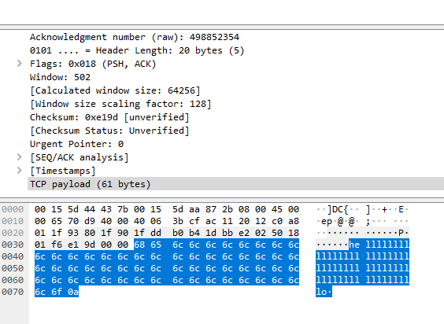

# Socket io TCP

Socket programming with Java socket IO.

Features :

- Implement a TCP echo server (Sequential & multithreading versions)
- Implement a TCP ping server
- Implement a TCP SSL ping server
- Observations with Wireshark.

Exercise for University.

[[_TOC_]]

## Partie 1 : Le classique serveur Echo

### EXERCICE 1 : Version séquentielle

#### Package : fr.istic.pr.echo

#### Class : EchoServer

[**Click here for code.**](src/main/java/fr/istic/pr/echo/EchoServer.java)

````

We...

- Create a server socket that waits :

```java
int listeningPort = 8080;
ServerSocket serverSocket = new ServerSocket(listeningPort);
````

- Accept a connection with :

```java
Socket clientSocket=serverSocket.accept();
```

- Create a ClientHandler:

```java
ClientHandler handler=new ClientHandlerBytes(clientSocket);
```

OR

```java
ClientHandler handler=new ClientHandlerChar(clientSocket);
```

- Call the handle() method with:

```java
handler.handle();
```

- We also don't forget to close the client connection

```java
clientSocket.close();
```

- And manage exceptions with the try/catch.

#### Class : ClientHandlerBytes

[**Click here for code.**](src/main/java/fr/istic/pr/echo/ClientHandlerBytes.java)

First, we get the clientSocket back:

```java
public ClientHandlerBytes(Socket socket){
        this.socket=socket;
        }
```

Then we override the handle() method to do the echo.

We need to initialise the Objects that we need for this action.  
The input stream will manage the received message.  
The output stream will send the message back to the client.

```java
//Init input
InputStream in=this.socket.getInputStream();

//Init buffer
        byte[]buffer=new byte[8];

//Init output
        OutputStream out=this.socket.getOutputStream();
```

We read fill the buffer until there's no message left, and send the parts each time to the client. We need to remember
to flush the buffer to avoid issues.

```java
//Read message in byte buffer
while(in.read(buffer)!=-1){
        //Send buffer
        out.write(buffer);

        //Print in console for log
        String s=new String(buffer,StandardCharsets.UTF_8);
        System.out.println("Handler for "+this.socket.getInetAddress()+" wrote "+s);

        //Empty buffer for next loop
        Arrays.fill(buffer,(byte)0);
        }
```

#### Class : ClientHandlerChar

[**Click here for code.**](src/main/java/fr/istic/pr/echo/ClientHandlerChar.java)

ClientHandlerChar is almost the same as ClientHandlerBytes, but we're using a BufferedReader for input and a PrintWriter
for output.

```java
//Init input
InputStream in=this.socket.getInputStream();
        BufferedReader bufferedReader=new BufferedReader(new InputStreamReader(in));

//Init line buffer
        String thisLine;

//Init output
        OutputStream out=this.socket.getOutputStream();
        PrintWriter printWriter=new PrintWriter(out);
```

Then we're handling message and response with this while loop

```java
while((thisLine=bufferedReader.readLine())!=null)
        {
        //Log
        printWriter.println(thisLine);
        System.out.println("Handler for "+this.socket.getInetAddress()+" wrote "+thisLine);

        //Send line
        printWriter.flush();
        }
```

/!\ We use the method flush() to send and empty the buffer.

### EXERCICE 2 : Test et capture

Here is a screenshot of a Wireshark exchange:


We can see that we have :

- line 0-1 : SYN/ACK for Client/Server connection.
- line 3-7 : message sent and echo from server.
- line 8-11 : FIN/ACK when client is closing connection.

We can follow the conversation/messages with "Analyse > Follow > TCP Stream".


#### Questions

- Is the text of the conversation readable ?  
  **Yes (see screenshot)**

For ClientHandlerBytes :

- What happens when the size of the message is bigger than the buffer ?  
  **The message will be split in as many bytes as possible so it can be handled in parts until the end of it.**
- Does TCP segments size match buffer size ?  
  **No. The buffer size is 8 bytes, and the TCP payload is different depending on its content. Here's two examples :**

**Message : hello (size 7 bytes)**


**Message : hellll...o (size 61 bytes)**


### EXERCICE 3 : Version Multithreadée

**Package : fr.istic.pr.echomt**

**Class : EchoServerMT**

[**Click here for code.**](src/main/java/fr/istic/pr/echomt/EchoServerMT.java)

The class is almost identical to EchoServer, the few differences are...

- Creating an executor to manage 4 threads:

```java
Executor service=Executors.newFixedThreadPool(4);
```

- Calling a ClientHandler with the Executor object;

```java
service.execute(new ClientHandlerCharMT(clientSocket));
```

- Now, we also close the client connection on the handler's side.

#### Class : ClientHandlerCharMT

[**Click here for code.**](src/main/java/fr/istic/pr/echomt/ClientHandlerCharMT.java)

The class is almost identical to ClientHandlerChar, but there's a few differences...

- It implements "Runnable", and override a run() method which is only used to call this.handle().

```java
@Override
public void run(){
        handle();
        }
```

Capture of Wireshark showing 2 connected clients...

- On port 37770:
  
- On port 37772:
  

## Partie 2 : Implémentation d'un client HTTPping

### EXERCICE 1 : Analyse du protocole HTTP

Domain : http://example.com  
IP : 93.184.216.34 (from nslookup)  
Wireshark filter :

```
ip.addr == 93.184.216.34
```

Capture of the request/response on example.com.


#### Questions

**Request side :**

- What is the role of the first line ?  
  **The first line indicate the type of the request (GET), the requested page (/) and the protocol (HTTP/1.1).**

- Décrivez le rôle des options :
    - "Accept-Encoding:"  
      **Indicate if we want compression.**
    - "Accept:"  
      **Indicate the type of content we can understand.**
    - and "Connection: keep-alive"  
      **Indicate if the connection should stay open.**

**Server side :**

- Describe the first line. What is the answer code for?  
  **HTTP/1.1 304 Not Modified.  
  It was 200 OK at first, so the request was successful. But then i refreshed the page and 304 was sent to say the page
  didn't change. (Get it from cache).**

- Find a site whose answer is 404 or 403. With the help of the spec describe the main steps of the protocol for
  retrieving a page?

  **Requested page : http://example.com/nothing**
  

  **Requested page : http://httpstat.us/403**
  

  **Main steps for retrieving the page :**

    - Client create a connection with the server (socket).
    - Client send GET request with page.
    - Server read request.
    - Check if the page exist.
    - If not send 404.
    - If yes but need permissions, 403.
    - Else send 200 and page.
    - Keep open or close connection.

### Exercice 2 : Récupération d'une page avec netcat

#### Questions

- Does example.com support the HTTP/1.0 protocol?

**Use netcat to type this.**

```sh
nc www.example.com 80
GET / HTTP/1.0
Host : example.com
Connexion: close

```

**We successfully got a response.**

```sh
HTTP/1.0 200 OK
Age: 579106
Cache-Control: max-age=604800
Content-Type: text/html; charset=UTF-8
Date: Thu, 21 Jan 2021 15:38:45 GMT
Etag: "3147526947+ident"
Expires: Thu, 28 Jan 2021 15:38:45 GMT
Last-Modified: Thu, 17 Oct 2019 07:18:26 GMT
Server: ECS (bsa/EB12)
Vary: Accept-Encoding
X-Cache: HIT
Content-Length: 1256
Connection: close
```

(Html body omitted but it's plain text).

- What is the encoding used for the type of return?

**There's no specified encoding, it's plain text, as written in Content-type. We could add the Accept-Encoding header to
accept more formats.**

- What happens if you add "Accept-Encoding: gzip"?

**A new header appears : Content-Encoding: gzip. The HTML Body is now compressed.**

**Request**

```sh
nc www.example.com 80
GET / HTTP/1.1
Host : example.com
Accept-Encoding : gzip
Connexion: close
```

**Response**

```sh
HTTP/1.1 200 OK
Content-Encoding: gzip
Accept-Ranges: bytes
Age: 110138
Cache-Control: max-age=604800
Content-Type: text/html; charset=UTF-8
Date: Thu, 21 Jan 2021 15:45:42 GMT
Etag: "3147526947"
Expires: Thu, 28 Jan 2021 15:45:42 GMT
Last-Modified: Thu, 17 Oct 2019 07:18:26 GMT
Server: ECS (bsa/EB14)
Vary: Accept-Encoding
X-Cache: HIT
Content-Length: 648
Connection: close
```

(Html body omitted but it's not humain readable).

### Exercice 3, Implémentation du HTTP ping

**Package : fr.istic.pr.ping**
**Class : HttpPing**

[**Click here for code.**](src/main/java/fr/istic/pr/ping/HttpPing.java)

**Output**


### Exercice 4 : Socket sécurisée

**Package : fr.istic.pr.ping**  
**Class : HttpsPing.java**

[**Click here for code.**](src/main/java/fr/istic/pr/ping/HttpsPing.java)

````

**Wireshark**
Filter used :

```sh
ip.addr == 216.58.213.131
````

**Exchange is encrypted.**


## Partie 3 : Implémentation d'un serveur HTTP simple

**Package : fr.istic.pr.serveur**

**Class : HTTPServer.java**

[**Click here for code.**](src/main/java/fr/istic/pr/serveur/HTTPServer.java)

**Class : HTTPHandler.java**

[**Click here for code.**](src/main/java/fr/istic/pr/serveur/HTTPHandler.java)

**Web page**


**Console log**

