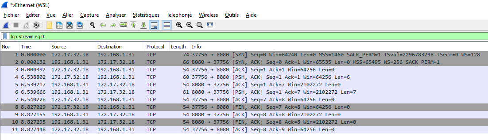
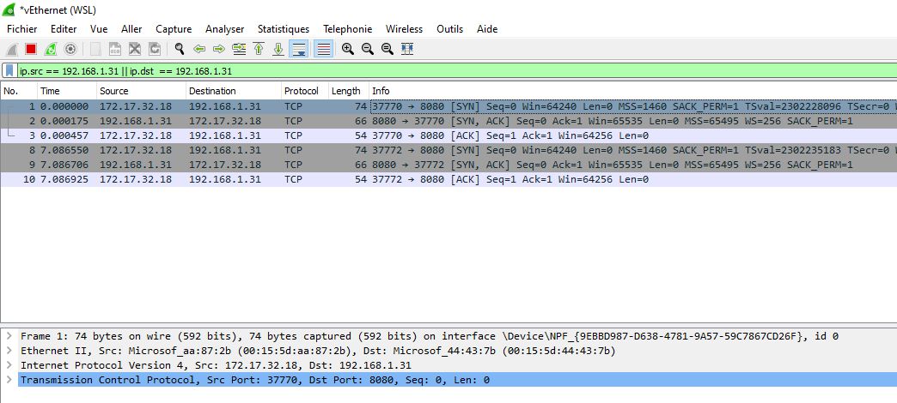
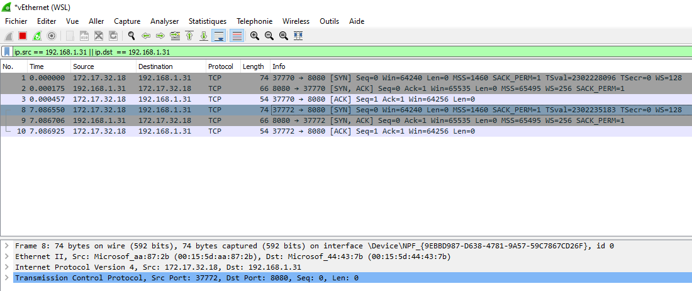
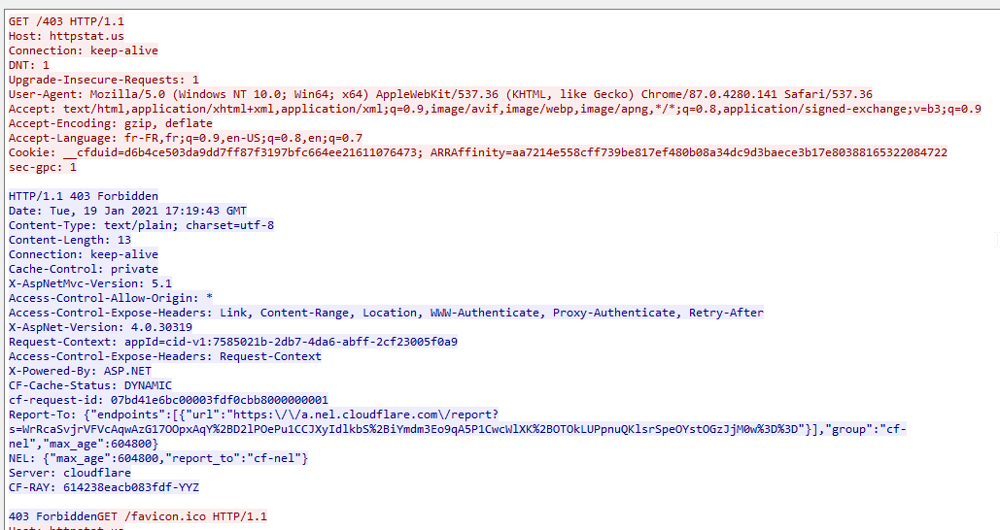
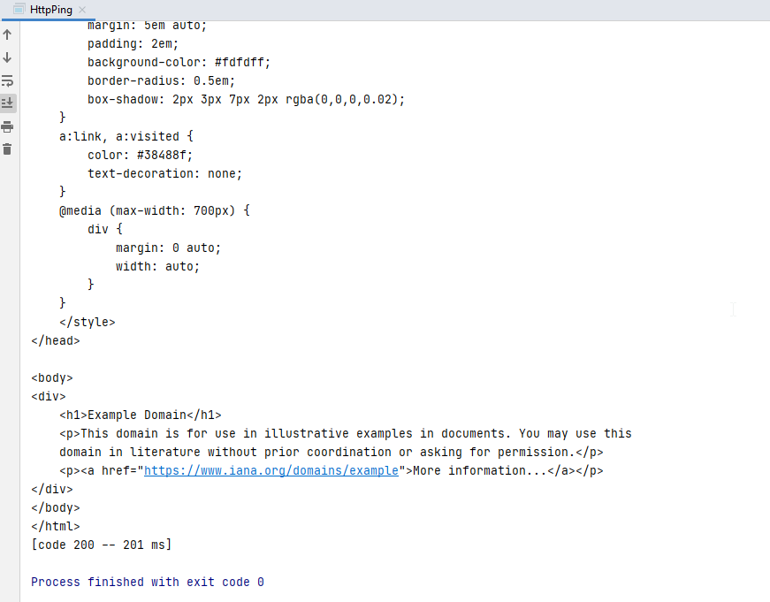
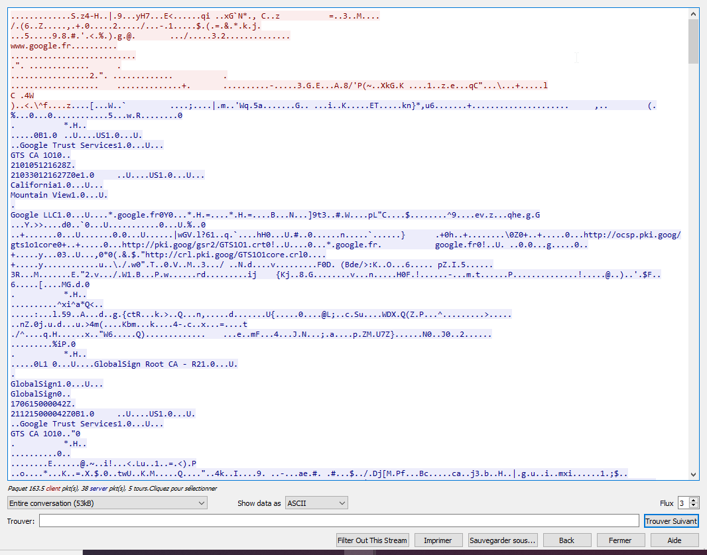

# TP1 : Socket io TCP

[[_TOC_]]

## Partie 1 : Le classique serveur Echo

### EXERCICE 1 : Version séquentielle

#### Package : fr.istic.pr.echo

#### Class : EchoServer

[Click here](src/main/java/fr/istic/pr/echo/EchoServer.java)

```java
package fr.istic.pr.echo;

import java.io.IOException;
import java.net.ServerSocket;
import java.net.Socket;
import java.util.Scanner;

/**
 * Class Echo server<br>
 * Accept connections on 8080<br>
 * Use handler to answer<br>
 * The goal is to send back the message to the client (echo)
 *
 * @see ClientHandlerBytes
 * @see ClientHandlerChar
 */
public class EchoServer {

    /**
     * Main<br>
     * Choose a type of handler and wait connections
     *
     * @param args _
     * @throws IOException if socket can't be opened
     */
    public static void main(String[] args) throws Exception {
        //Waiting on port 8080
        int listeningPort = 8080;
        ServerSocket serverSocket = new ServerSocket(listeningPort);

        //Ask for ClientHandlerBytes or ClientHandlerChar
        Scanner sc = new Scanner(System.in);
        String sb = "Choose one :\n" +
                "ClientHandlerBytes\t:\t0\n" +
                "ClientHandlerChar\t:\t1\n";
        System.out.println(sb);
        int choice = sc.nextInt();
        if (choice != 0 && choice != 1) {
            throw new Exception("This handler doesn't exist.");
        }

        /* For each client :
            1. accept connection
            2. create ClientHandler
            3. call method handle() on handler
        */
        try {
            System.out.println("Server started.");
            while (true) {
                Socket clientSocket = serverSocket.accept();
                System.out.println("Client " + clientSocket.getInetAddress() + " is connected.");

                ClientHandler handler;

                switch (choice) {
                    case 0:
                        handler = new ClientHandlerBytes(clientSocket);
                        break;
                    case 1:
                        handler = new ClientHandlerChar(clientSocket);
                        break;
                    default:
                        throw new Exception("Error picking handler.");

                }

                handler.handle();

                clientSocket.close();
                System.out.println("Client " + clientSocket.getInetAddress() + " is disconnected");
            }
        } catch (IOException exception) {
            System.out.println("Error :" + exception.getMessage());
        } catch (Exception e) {
            e.printStackTrace();
        } finally {
            serverSocket.close();
            System.out.println("Server closed.");

        }


    }
}
```

We...

- Create a server socket that waits :

```java
int listeningPort = 8080;
ServerSocket serverSocket = new ServerSocket(listeningPort);
```

- Accept a connection with :

```java
Socket clientSocket = serverSocket.accept();
```

- Create a ClientHandler:

```java
ClientHandler handler = new ClientHandlerBytes(clientSocket);
```

OR

```java
ClientHandler handler = new ClientHandlerChar(clientSocket);
```

- Call the handle() method with:

```java
handler.handle();
```

- We also don't forget to close the client connection

```java
clientSocket.close();
```

- And manage exceptions with the try/catch.

#### Class : ClientHandlerBytes

```java
package fr.istic.pr.echo;

import java.io.InputStream;
import java.io.OutputStream;
import java.net.Socket;
import java.nio.charset.StandardCharsets;
import java.util.Arrays;

/**
 * Handle client with a fixed byteBuffer
 */
public class ClientHandlerBytes implements ClientHandler {

    private final Socket socket;

    /**
     * Constructor
     *
     * @param socket, the client socket
     */
    public ClientHandlerBytes(Socket socket) {
        this.socket = socket;
    }

    public void handle() {
        try {
            //Init input
            System.out.println("Handler started for " + this.socket.getInetAddress() + ".");
            InputStream in = this.socket.getInputStream();

            //Init buffer
            byte[] buffer = new byte[8];

            //Init output
            OutputStream out = this.socket.getOutputStream();

            //Read message in byte buffer
            while (in.read(buffer) != -1) {
                //Send buffer
                out.write(buffer);

                //Print in console for log
                String s = new String(buffer, StandardCharsets.UTF_8);
                System.out.println("Handler for " + this.socket.getInetAddress() + " wrote " + s);

                //Empty buffer for next loop
                Arrays.fill(buffer, (byte) 0);
                //out.flush();
            }

        } catch (Exception e) {
            System.out.println("Error :" + e.getMessage());
        }
    }
}
```

First, we get the clientSocket back:

```java
public ClientHandlerBytes(Socket socket) {
    this.socket = socket;
}
```

Then we override the handle() method to do the echo.

We need to initialise the Objects that we need for this action.  
The input stream will manage the received message.  
The output stream will send the message back to the client.

```java
//Init input
InputStream in = this.socket.getInputStream();

//Init buffer
byte[] buffer = new byte[8];

//Init output
OutputStream out = this.socket.getOutputStream();
```

We read fill the buffer until there's no message left, and send the parts each time to the client.
We need to remember to flush the buffer to avoid issues.

```java
//Read message in byte buffer
while (in.read(buffer) != -1) {
    //Send buffer
    out.write(buffer);

    //Print in console for log
    String s = new String(buffer, StandardCharsets.UTF_8);
    System.out.println("Handler for " + this.socket.getInetAddress() + " wrote " + s);

    //Empty buffer for next loop
    Arrays.fill(buffer, (byte) 0);
}
```

#### Class : ClientHandlerChar

```java
package fr.istic.pr.echo;

import java.io.*;
import java.net.Socket;

/**
 * Handle client with a BufferedReader & PrintWriter
 */
public class ClientHandlerChar implements ClientHandler {

    private final Socket socket;

    /**
     * Constructor
     *
     * @param socket, the client socket
     */
    public ClientHandlerChar(Socket socket) {
        this.socket = socket;
    }

    public void handle() {
        try {
            System.out.println("Handler started for " + this.socket.getInetAddress() + ".");

            //Init input
            InputStream in = this.socket.getInputStream();
            BufferedReader bufferedReader = new BufferedReader(new InputStreamReader(in));

            //Init line buffer
            String thisLine;

            //Init output
            OutputStream out = this.socket.getOutputStream();
            PrintWriter printWriter = new PrintWriter(out);

            while ((thisLine = bufferedReader.readLine()) != null) {
                //Log
                printWriter.println(thisLine);
                System.out.println("Handler for " + this.socket.getInetAddress() + " wrote " + thisLine);

                //Send line
                printWriter.flush();
            }

        } catch (Exception e) {
            System.out.println("Error :" + e.getMessage());
        }
    }
}

```

ClientHandlerChar is almost the same as ClientHandlerBytes, but we're using a BufferedReader for input and a PrintWriter for output.

```java
//Init input
InputStream in = this.socket.getInputStream();
BufferedReader bufferedReader = new BufferedReader(new InputStreamReader(in));

//Init line buffer
String thisLine;

//Init output
OutputStream out = this.socket.getOutputStream();
PrintWriter printWriter = new PrintWriter(out);
```

Then we're handling message and response with this while loop

```java
while ((thisLine = bufferedReader.readLine()) != null)
{
    //Log
    printWriter.println(thisLine);
    System.out.println("Handler for " + this.socket.getInetAddress() + " wrote " + thisLine);

    //Send line
    printWriter.flush();
}
```

/!\ We use the method flush() to send and empty the buffer.

### EXERCICE 2 : Test et capture

Here is a screenshot of a Wireshark exchange:



We can see that we have :

- line 0-1 : SYN/ACK for Client/Server connection.
- line 3-7 : message sent and echo from server.
- line 8-11 : FIN/ACK when client is closing connection.

We can follow the conversation/messages with "Analyse > Follow > TCP Stream".


#### Questions

- Is the text of the conversation readable ?  
  **Yes (see screenshot)**

For ClientHandlerBytes :

- What happens when the size of the message is bigger than the buffer ?  
  **The message will be split in as many bytes as possible so it can be handled in parts until the end of it.**
- Does TCP segments size match buffer size ?  
   **No. The buffer size is 8 bytes, and the TCP payload is different depending on its content. Here's two examples :**

**Message : hello (size 7 bytes)**


**Message : hellll...o (size 61 bytes)**


### EXERCICE 3 : Version Multithreadée

**Package : fr.istic.pr.echomt**

Class : EchoServerMT

```java
package fr.istic.pr.echomt;

import java.io.IOException;
import java.net.ServerSocket;
import java.net.Socket;
import java.util.Scanner;
import java.util.concurrent.Executor;
import java.util.concurrent.Executors;

/**
 * Class Echo server<br>
 * Accept connections on 8080<br>
 * Use handler to answer<br>
 * The goal is to send back the message to the client (echo)
 *
 * @see ClientHandlerBytesMT
 * @see ClientHandlerCharMT
 */
public class EchoServerMT {

    /**
     * Main<br>
     * Choose a type of handler and wait connections
     *
     * @param args _
     * @throws IOException if socket can't be opened
     */
    public static void main(String[] args) throws Exception {
        //Waiting on port 8080
        int listeningPort = 8080;
        ServerSocket serverSocket = new ServerSocket(listeningPort);

        //Ask for ClientHandlerBytes or ClientHandlerChar
        Scanner sc = new Scanner(System.in);
        String sb = "Choose one :\n" +
                "ClientHandlerBytesMT\t:\t0\n" +
                "ClientHandlerCharMT\t:\t1\n";
        System.out.println(sb);
        int choice = sc.nextInt();
        if (choice != 0 && choice != 1) {
            throw new Exception("This handler doesn't exist.");
        }

        /* For each client :
            1. accept connection
            2. create ClientHandler
            3. call method handle() on handler
        */
        try {
            System.out.println("Server started.");
            while (true) {

                Executor service = Executors.newFixedThreadPool(4);

                Socket clientSocket = serverSocket.accept();
                System.out.println("Client " + clientSocket.getInetAddress() + " is connected.");

                switch (choice) {
                    case 0:
                        service.execute(new ClientHandlerBytesMT(clientSocket));
                        break;
                    case 1:
                        service.execute(new ClientHandlerCharMT(clientSocket));
                        break;
                    default:
                        throw new Exception("Error picking handler.");

                }

            }
        } catch (IOException exception) {
            System.out.println("Error :" + exception.getMessage());
        } catch (Exception e) {
            e.printStackTrace();
        } finally {
            serverSocket.close();
            System.out.println("Server closed.");

        }


    }
}
```

The class is almost identical to EchoServer, the few differences are...

- Creating an executor to manage 4 threads:

```java
Executor service = Executors.newFixedThreadPool(4);
```

- Calling a ClientHandler with the Executor object;

```java
service.execute(new ClientHandlerCharMT(clientSocket));
```

- Now, we also close the client connection on the handler's side.

#### Class : ClientHandlerMT

```java
package fr.istic.pr.echomt;

import fr.istic.pr.echo.ClientHandler;

import java.io.*;
import java.net.Socket;

/**
 * Handle client with a BufferedReader & PrintWriter
 */
public class ClientHandlerCharMT implements ClientHandler, Runnable {

    private final Socket socket;

    /**
     * Constructor
     *
     * @param socket, the client socket
     */
    public ClientHandlerCharMT(Socket socket) {
        this.socket = socket;
    }


    @Override
    public void handle() {
        try {
            System.out.println("Handler started for " + this.socket.getInetAddress() + ".");

            //Init input
            InputStream in = this.socket.getInputStream();
            BufferedReader bufferedReader = new BufferedReader(new InputStreamReader(in));

            //Init line buffer
            String thisLine;

            //Init output
            OutputStream out = this.socket.getOutputStream();
            PrintWriter printWriter = new PrintWriter(out);

            while ((thisLine = bufferedReader.readLine()) != null) {
                //Log
                printWriter.println(thisLine);
                System.out.println("Handler for " + this.socket.getInetAddress() + " wrote " + thisLine);

                //Send line
                printWriter.flush();
            }

            this.socket.close();
            System.out.println("Client " + this.socket.getInetAddress() + " is disconnected");


        } catch (Exception e) {
            System.out.println("Error :" + e.getMessage());
        }


    }

    @Override
    public void run() {
        handle();
    }
}
```

The class is almost identical to ClientHandlerChar, but there's a few differences...

- It implements "Runnable", and override a run() method which is only used to call this.handle().

```java
@Override
public void run() {
    handle();
}
```

Capture of Wireshark showing 2 connected clients...

- On port 37770:
  
- On port 37772:
  

## Partie 2 : Implémentation d'un client HTTPping

### EXERCICE 1 : Analyse du protocole HTTP

Domain : http://example.com  
IP : 93.184.216.34 (from nslookup)  
Wireshark filter :

```
ip.addr == 93.184.216.34
```

Capture of the request/response on example.com.


#### Questions

**Request side :**

- What is the role of the first line ?  
  **The first line indicate the type of the request (GET), the requested page (/) and the protocol (HTTP/1.1).**

- Décrivez le rôle des options :
  - "Accept-Encoding:"  
    **Indicate if we want compression.**
  - "Accept:"  
    **Indicate the type of content we can understand.**
  - and "Connection: keep-alive"  
    **Indicate if the connection should stay open.**

**Server side :**

- Describe the first line. What is the answer code for?  
  **HTTP/1.1 304 Not Modified.  
   It was 200 OK at first, so the request was successful. But then i refreshed the page and 304 was sent to say the page didn't change. (Get it from cache).**

- Find a site whose answer is 404 or 403.
  With the help of the spec describe the main steps of the protocol for retrieving a page?

  **Requested page : http://example.com/nothing**
  

  **Requested page : http://httpstat.us/403**
  

  **Main steps for retrieving the page :**

  - Client create a connection with the server (socket).
  - Client send GET request with page.
  - Server read request.
  - Check if the page exist.
  - If not send 404.
  - If yes but need permissions, 403.
  - Else send 200 and page.
  - Keep open or close connection.

### Exercice 2 : Récupération d'une page avec netcat

#### Questions

- Does example.com support the HTTP/1.0 protocol?

**Use netcat to type this.**

```sh
nc www.example.com 80
GET / HTTP/1.0
Host : example.com
Connexion: close

```

**We successfully got a response.**

```sh
HTTP/1.0 200 OK
Age: 579106
Cache-Control: max-age=604800
Content-Type: text/html; charset=UTF-8
Date: Thu, 21 Jan 2021 15:38:45 GMT
Etag: "3147526947+ident"
Expires: Thu, 28 Jan 2021 15:38:45 GMT
Last-Modified: Thu, 17 Oct 2019 07:18:26 GMT
Server: ECS (bsa/EB12)
Vary: Accept-Encoding
X-Cache: HIT
Content-Length: 1256
Connection: close
```

(Html body omitted but it's plain text).

- What is the encoding used for the type of return?

**There's no specified encoding, it's plain text, as written in Content-type. We could add the Accept-Encoding header to accept more formats.**

- What happens if you add "Accept-Encoding: gzip"?

**A new header appears : Content-Encoding: gzip. The HTML Body is now compressed.**

**Request**

```sh
nc www.example.com 80
GET / HTTP/1.1
Host : example.com
Accept-Encoding : gzip
Connexion: close
```

**Response**

```sh
HTTP/1.1 200 OK
Content-Encoding: gzip
Accept-Ranges: bytes
Age: 110138
Cache-Control: max-age=604800
Content-Type: text/html; charset=UTF-8
Date: Thu, 21 Jan 2021 15:45:42 GMT
Etag: "3147526947"
Expires: Thu, 28 Jan 2021 15:45:42 GMT
Last-Modified: Thu, 17 Oct 2019 07:18:26 GMT
Server: ECS (bsa/EB14)
Vary: Accept-Encoding
X-Cache: HIT
Content-Length: 648
Connection: close
```

(Html body omitted but it's not humain readable).

### Exercice 3, Implémentation du HTTP ping

**Package : fr.istic.pr.ping**
**Class : HttpPing**

```java
package fr.istic.pr.ping;

import java.io.*;
import java.net.Socket;
import java.net.UnknownHostException;
import java.nio.charset.StandardCharsets;

/**
 * Class HttpPing<br>
 * Show :<br>
 * - Response time<br>
 * - Response Code<br>
 * - Body
 */
public class HttpPing {

    /**
     * Inner class, contains information of the response
     */
    public static class PingInfo {
        /**
         * Response time
         */
        long time;
        /**
         * Response code
         */
        int code;

        @Override
        public String toString() {
            return String.format("[code %d -- %d ms]", code, time);
        }
    }

    /**
     * Main
     *
     * @param args _
     * @throws UnknownHostException, host is not found
     * @throws IOException,          exception for ping() function
     */
    public static void main(String[] args) throws UnknownHostException, IOException {
        System.out.println(ping("www.example.com", 80));
    }

    /**
     * ping method, ping a specific host/port
     *
     * @param host, host address
     * @param port, host port
     * @return PingInfo, object that contains info about the response
     * @throws UnknownHostException, host not found
     * @throws IOException,          exception for Socket
     */
    public static PingInfo ping(String host, int port) throws UnknownHostException, IOException {
        //Create object to return
        PingInfo info = new PingInfo();

        //Start timer
        long time = System.currentTimeMillis();

        //Create socket to connect to host
        Socket socket = new Socket(host, port);

        // USE PrintWriter and BufferedReader
        OutputStream out = socket.getOutputStream();
        PrintWriter printWriter = new PrintWriter(new OutputStreamWriter(out, StandardCharsets.UTF_8));
        printWriter.println();
        /// Send headers
        printWriter.println("GET / HTTP/1.1");
        // Also put host
        printWriter.println("Host : " + host);
        // Header should also contains this to ask the website to close connection after response
        printWriter.println("Connection: close");
        // end with empty line
        printWriter.println();
        //Send
        printWriter.flush();

        // Read response
        InputStream in = socket.getInputStream();
        BufferedReader bufferedReader = new BufferedReader(new InputStreamReader(in));

        info.code = Integer.parseInt(bufferedReader.readLine().split(" ")[1]);

        String buffer = " ";
        //Skip headers
        while (bufferedReader.ready() && !buffer.equals("")) {
            buffer = bufferedReader.readLine();
        }

        //Print page
        while (bufferedReader.ready()) {
            buffer = bufferedReader.readLine();
            System.out.println(buffer);
        }

        info.time = System.currentTimeMillis() - time;
        return info;
    }

}

```

**Output**


### Exercice 4 : Socket sécurisée

**Package : fr.istic.pr.ping**  
**Class : HttpsPing.java**

```java
package fr.istic.pr.ping;

import javax.net.ssl.SSLSocketFactory;
import java.io.*;
import java.net.Socket;
import java.net.UnknownHostException;
import java.nio.charset.StandardCharsets;

/**
 * Class HttpsPing<br>
 * Show :<br>
 * - Response time<br>
 * - Response Code<br>
 * - Body
 */
public class HttpsPing {

    /**
     * Inner class, contains information of the response
     */
    public static class PingInfo {
        /**
         * Response time
         */
        long time;
        /**
         * Response code
         */
        int code;

        @Override
        public String toString() {
            return String.format("[code %d -- %d ms]", code, time);
        }
    }

    /**
     * Main
     *
     * @param args _
     * @throws UnknownHostException, host is not found
     * @throws IOException,          exception for ping() function
     */
    public static void main(String[] args) throws UnknownHostException, IOException {
        System.out.println(ping("www.google.fr", 443));
    }

    /**
     * ping method, ping a specific host/port
     *
     * @param host, host address
     * @param port, host port
     * @return PingInfo, object that contains info about the response
     * @throws UnknownHostException, host not found
     * @throws IOException,          exception for Socket
     */
    public static PingInfo ping(String host, int port) throws UnknownHostException, IOException {
        //Create object to return
        PingInfo info = new PingInfo();

        //Start timer
        long time = System.currentTimeMillis();

        //Create socket to connect to host
        SSLSocketFactory factory = (SSLSocketFactory) SSLSocketFactory.getDefault();
        Socket socket = factory.createSocket(host, port);

        // USE PrintWriter and BufferedReader
        OutputStream out = socket.getOutputStream();
        PrintWriter printWriter = new PrintWriter(new OutputStreamWriter(out, StandardCharsets.UTF_8));
        printWriter.println();
        /// Send headers
        printWriter.println("GET / HTTP/1.1");
        // Also put host
        printWriter.println("Host : " + host);
        // Header should also contains this to ask the website to close connection after response
        printWriter.println("Connection: close");
        // end with empty line
        printWriter.println();
        //Send
        printWriter.flush();

        // Read response
        InputStream in = socket.getInputStream();
        BufferedReader bufferedReader = new BufferedReader(new InputStreamReader(in));

        info.code = Integer.parseInt(bufferedReader.readLine().split(" ")[1]);

        String buffer = " ";
        //Skip headers
        while (bufferedReader.ready() && !buffer.equals("")) {
            buffer = bufferedReader.readLine();
        }

        //Print page
        while (bufferedReader.ready()) {
            buffer = bufferedReader.readLine();
            System.out.println(buffer);
        }

        info.time = System.currentTimeMillis() - time;
        return info;
    }

}

```

**Wireshark**  
Filter used :

```sh
ip.addr == 216.58.213.131
```

**Exchange is encrypted.**


## Partie 3 : Implémentation d'un serveur HTTP simple

**Package : fr.istic.pr.serveur**

**Class : HttpServer.java**

```java
package fr.istic.pr.serveur;

import java.io.IOException;
import java.net.ServerSocket;
import java.net.Socket;
import java.util.concurrent.Executor;
import java.util.concurrent.Executors;

/**
 * Class HTTP server<br>
 * Accept connections on 8080<br>
 * Use handler to answer<br>
 * The goal is to send back the test.html page to the client
 */
public class HTTPServer {

    /**
     * Main<br>
     * Choose a type of handler and wait connections
     *
     * @param args _
     * @throws IOException if socket can't be opened
     */
    public static void main(String[] args) throws Exception {
        //Waiting on port 8080
        int listeningPort = 8080;
        ServerSocket serverSocket = new ServerSocket(listeningPort);

        /* For each client :
            1. accept connection
            2. create ClientHandler
            3. call method handle() on handler
        */
        try {
            System.out.println("Server started.");
            while (true) {

                Executor service = Executors.newFixedThreadPool(4);

                Socket clientSocket = serverSocket.accept();
                System.out.println(clientSocket.getInetAddress() + " : Connected.");
                service.execute(new HTTPHandler(clientSocket));

            }
        } catch (IOException exception) {
            System.out.println("Error :" + exception.getMessage());
        } catch (Exception e) {
            e.printStackTrace();
        } finally {
            serverSocket.close();
            System.out.println("Server closed.");

        }


    }
}
```

**Class : HttpHandler.java**

```java
package fr.istic.pr.serveur;

/*imports*/

import fr.istic.pr.echo.ClientHandler;

import java.io.*;
import java.net.Socket;

public class HTTPHandler implements ClientHandler, Runnable {

    private Socket socket;

    /**
     * Constructor
     *
     * @param socket, the client's socket
     */
    public HTTPHandler(Socket socket) {
        this.socket = socket;
    }

    @Override
    public void handle() {
        // Crée les print writer et buffered reader

        InputStream in = null;
        BufferedReader bufferedReader = null;
        OutputStream out = null;
        PrintWriter printWriter = null;
        try {
            //Init in
            in = this.socket.getInputStream();
            bufferedReader = new BufferedReader(new InputStreamReader(in));

            //Init out
            out = this.socket.getOutputStream();
            printWriter = new PrintWriter(new OutputStreamWriter(out));


            // lit l'entête de la requête
            String buffer;
            if (bufferedReader.ready()) {
                buffer = bufferedReader.readLine();

                String[] firstLine = buffer.split(" ");
                String method = firstLine[0];
                String pagePath = firstLine[1];
                // Appelle doGet si la méthode est une méthode GET.
                if (method.equals("GET")) {
                    this.doGet(pagePath, printWriter);
                } else {
                    this.doError(printWriter);
                }
            }

            this.socket.close();
            System.out.println(this.socket.getInetAddress() + " : Disconnected.");
        } catch (IOException e) {
            e.printStackTrace();
        }


    }

    public void doGet(String pagepath, PrintWriter out) throws IOException {
        //Vérifie que le fichier existe
        //Prepare file
        String path = pagepath.substring(1);
        File f = new File("./www/" + path);

        // si le fichier existe :
        if (f.exists() && !f.isDirectory()) {
            System.out.println(this.socket.getInetAddress() + " : Get file " + f.getAbsolutePath());
            System.out.println(this.socket.getInetAddress() + " : File exist = " + f.exists());

            //Ecrit l'en-tête de réponse (Code, Content-type, Connexion, ...)
            /// Send headers
            out.println("HTTP/1.1 200 OK");
            out.println("Content-Type: text/html; charset=UTF-8");
            out.println("Connection: close");
            out.println();

            //Ecrit le contenu du fichier
            //Append page
            BufferedReader fin = new BufferedReader(new FileReader(f));
            String line;
            while ((line = fin.readLine()) != null) {
                out.println(line);
            }

            System.out.println(this.socket.getInetAddress() + " : Page " + pagepath + " served.");

        } else {
            // sinon
            // appelle la méthode send404.
            this.send404(out);
        }

        //Send
        out.flush();

    }

    public void send404(PrintWriter out) {
        //Envoie une réponse 404 si le fichier n'existe pas.
        out.println("HTTP/1.1 404 Not Found");
        out.println("Content-Type: text/html; charset=UTF-8");
        out.println("Connection: close");
        out.println();
        System.out.println(this.socket.getInetAddress() + " : 404 served.");
    }

    public void doError(PrintWriter out) {
        //Envoie une réponse avec le code 405 : Method Not Allowed
        out.println("HTTP/1.1 405 Method Not Allowed");
        out.println("Content-Type: text/html; charset=UTF-8");
        out.println("Connection: close");
        out.println();
        System.out.println(this.socket.getInetAddress() + " : 405 served.");
    }

    @Override
    public void run() {
        handle();
    }
}
```

**Web page**


**Console log**

